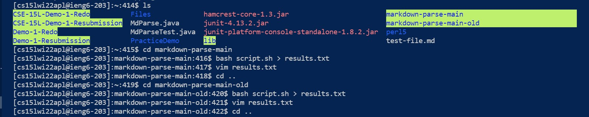
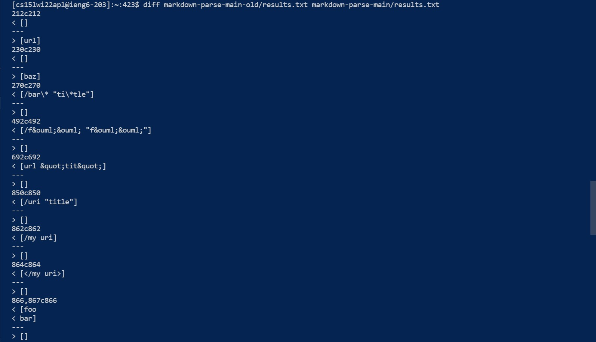
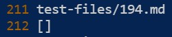
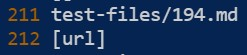
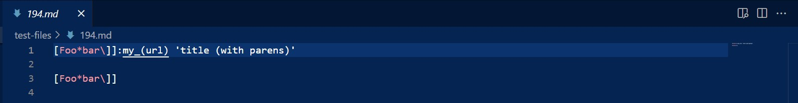
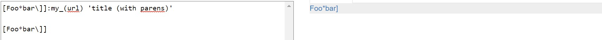
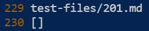
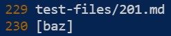
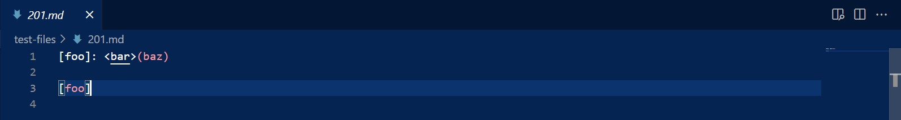
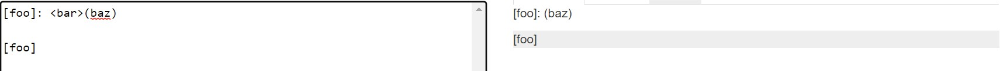

# [Week 10 Lab Report](https://github.com/bhacia/cse15l-week10-labreport5)

## How did I find the tests with different results?

- Make a txt file that'll show the test outputs through `bash script.sh > filename`
- 
  - The command `bash script.sh > results.txt` puts each test output in this txt file.
  - The command `vim results.txt` allows you to see the output.

- Copy over `script.sh` and the folder containing all the test files to my own makdown-parse directory.

- Make a another txt file using the same steps above.

- Compare the two implementations using the `diff` command.
  - 
  - Note that the first number and output belongs to my personal directory and the last number and output belongs to the provided implementation.
  
## Test One: Line 212; 194.md

My output:

- 

Provided output:

- 

### Describe which implementation is correct

File contents:

- 

Based on [the CommonMark demo site](https://spec.commonmark.org/dingus/), the output should produce:

- 
  - In other words: [my_(url)]
  
Therefore, both implementation are incorrect as none of our outputs were [my_(url)].

### Describe the bug(s)

- My code expects that the open parenthesis is directly after the closed bracket, so line 1 and line 3 wouldn't be seen as valid links.
- The provided code searches for the open parenthesis after the closed bracket, so that's why for line 1, it only sees what's in the parenthesis ("url") as a valid link. Then line 3 doesn't contain any parenthesis, so it wouldn't be a valid link.

## Test Two: Line 230; 201.md

My output:

- 

Provided output:

- 

### Describe which implementation is correct

File contents:

- 

Based on [the CommonMark demo site](https://spec.commonmark.org/dingus/), the output should produce:

- 
  - In other words: []
  
Therefore, my implementation is correct and the provided implementation is incorrect, as my output was [].

### Describe the bug(s)

- The provided code searches for the open parenthesis after the closed bracket, so that's why for line 1, it sees what's in the parenthesis ("baz") as a valid link. Then line 3 doesn't contain any parenthesis, so it wouldn't be a valid link.

### Suggestions for a better implementation
- If there are multiple ways a link could be valid besides the typical format, those should definitely be added to our code. For instacne, I didn't think line 1 in 194.md would be considered as a link since I only know of the standard valid link form. Perhaps the colon on that line allowed what's after it to be seen as a valid link!
